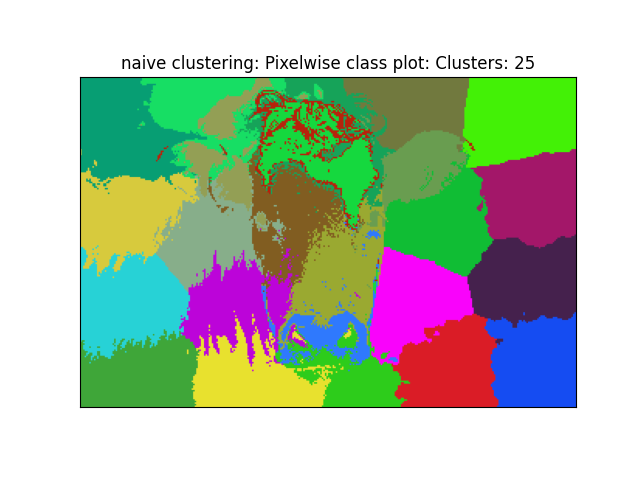
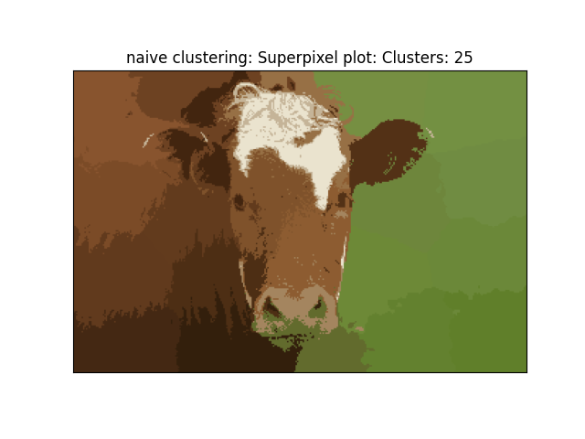
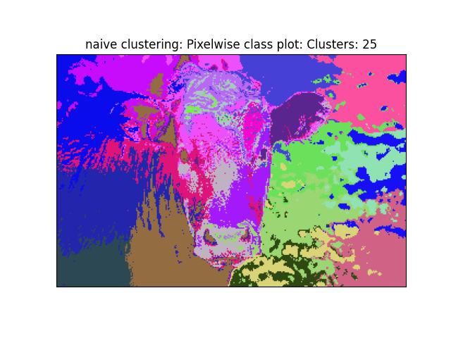
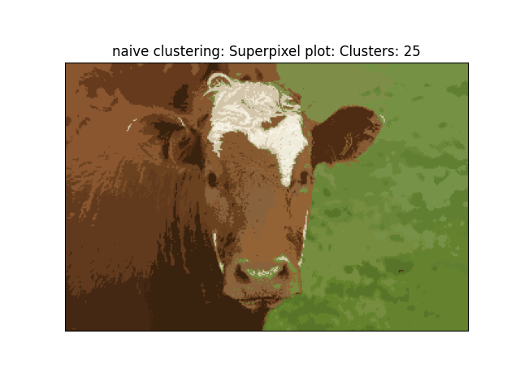
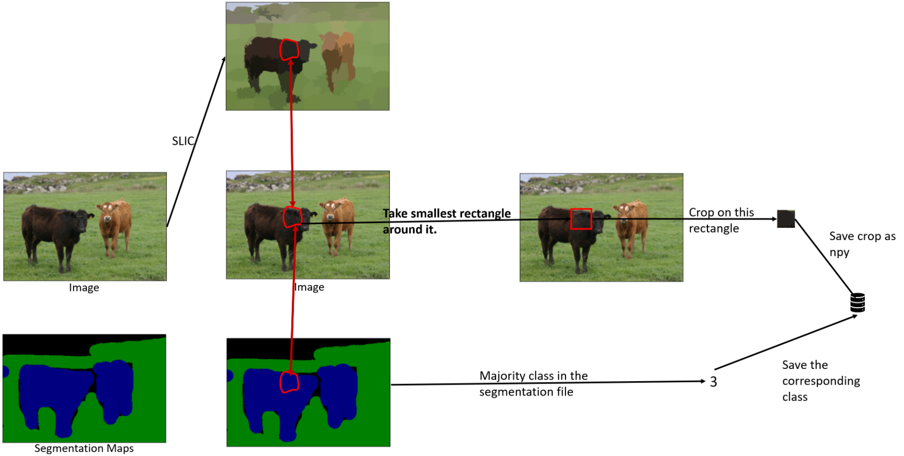

# slic-superpixels-image-segmentation
This project was composed of SLIC superpixel and image segmentation

## Dataset
You can download the sample dataset [here](https://download.microsoft.com/download/A/1/1/A116CD80-5B79-407E-B5CE-3D5C6ED8B0D5/msrc_objcategimagedatabase_v1.zip)

## Superpixels
A superpixel can be defined as a group of pixels that share similar characteristics (such as intensity, or distance). Superpixel algorithms have been widely applied to various tasks like Image Segmentation and Object detection. 

In the first part of the project, we implement Kmean and SLIC superpixel algorithms.

### Perform k-means on image pixels `(r, g, b, x, y)`
The k-means clustering algorithm is an unsupervised algorithm which, for some items and for some specified number of clusters represented by cluster centers, minimizes the distance between items and their associated cluster centers. It does so by iteratively assigning items to a cluster and recomputing the cluster center based on the assigned items.

We implement the pixel clustering function `Kmean_superpixel.py`. It takes input an image (shape = (n, m, 3)) and number of clusters. Each pixel should be represented by a vector with 3 values: (r, g, b, x, y)

 

### SLIC superpixel
SLIC (Simple Linear Iterative Clustering) algorithm generates superpixels by clustering pixels based on color similarity and proximity in the image plane. We implement SLIC algorithm `SLIC_superpixel.py` from scratch and the detail of the algorithm can be found [here](https://www.iro.umontreal.ca/~mignotte/IFT6150/Articles/SLIC_Superpixels.pdf)

 

## Image Segmentation
The goal of the second part is to build a segmentation network, which uses SLIC Superpixels as input. In essense, it will be a classifier for superpixels. The end product is a system which, when given an image, computes superpixels and classifies each superpixel as one of the 14 classes of MSRC v1.

### Superpixel Dataset
First, we dilate each superpixel and save the output superpixel patch from SLIC into 224X224 size image (after rescaling), along with the ground truth segments label.

For the purpose of consistency, we adopt the existing SLIC implementation from the scikit-learn machine learning package.

For each image
1. Get superpixels sp_i for image x. We adopt 100 segments in this assignment, `segments = slic(image, n_segments=100, compactness=10)`.
2. For every superpixel sp_i in the image  
    2.1. find the smallest rectangle which can enclose sp_i  
    2.2. Dilate the rectangle by 3 pixels. 
    2.3. Get the same region from the segmentation image (from the file with similar name with *_GT). The class for this sp_i is mode of segmentation classes in that same region. Save the dilated region as npy (jpg is lossy for such small patches).<be>

